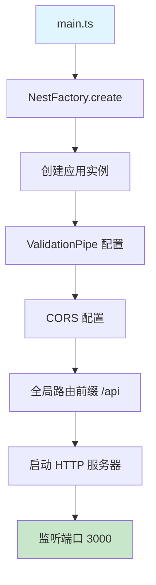
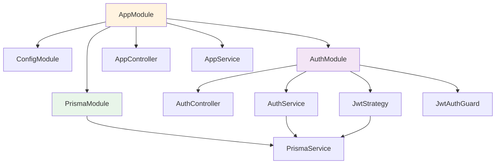
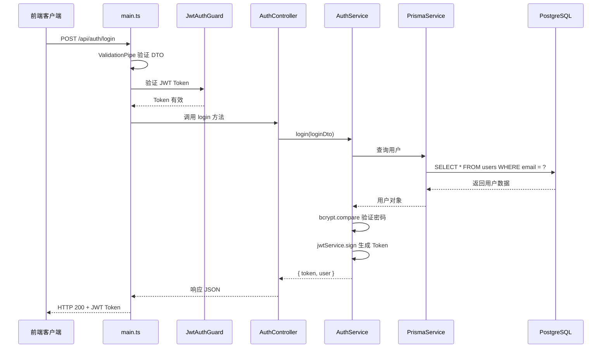
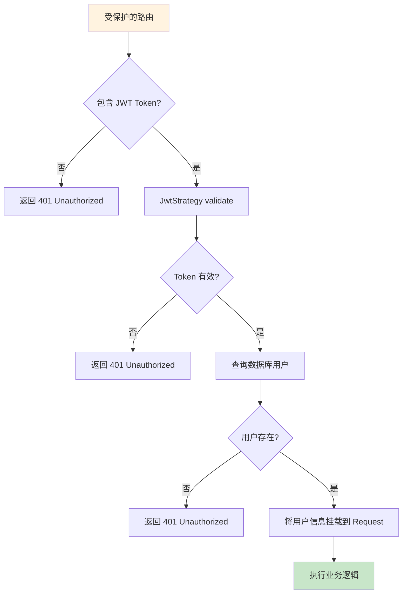
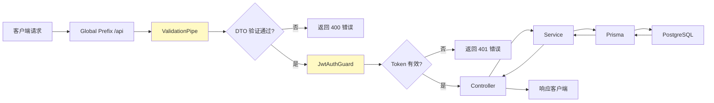

# StoryCanvas-API 代码运行流程图

## 1. 应用启动流程



## 2. 模块依赖关系



## 3. 请求处理流程（以登录为例）



## 4. 注册流程

```mermaid
flowchart TD
    A[POST /api/auth/register] --> B{验证邮箱格式}
    B -->|无效| C[返回 400 错误]
    B -->|有效| D{查询数据库}
    
    D --> E{用户已存在?}
    E -->|是| F[返回 409 Conflict<br/>'邮箱已被注册']
    E -->|否| G[bcrypt.hash 加密密码]
    
    G --> H[Prisma 创建用户]
    H --> I[数据库 INSERT]
    I --> J[JWT 生成 Token]
    J --> K[返回 201 + {token, user}]
    
    style A fill:#e3f2fd
    style K fill:#c8e6c9
```

## 5. 认证流程



## 6. 项目文件结构

```
story-canvas-api/
├── src/
│   ├── main.ts                 # 应用入口
│   ├── app.module.ts           # 根模块
│   ├── app.controller.ts       # 根控制器
│   ├── app.service.ts          # 根服务
│   │
│   ├── auth/                   # 认证模块
│   │   ├── auth.module.ts      # 认证模块定义
│   │   ├── auth.controller.ts  # 处理认证请求
│   │   ├── auth.service.ts     # 认证业务逻辑
│   │   ├── dto/                # 数据传输对象
│   │   │   ├── login.dto.ts
│   │   │   └── register.dto.ts
│   │   ├── strategies/          # Passport 策略
│   │   │   └── jwt.strategy.ts # JWT 验证策略
│   │   └── guards/              # 守卫
│   │       └── jwt-auth.guard.ts
│   │
│   └── prisma/                 # 数据库模块
│       ├── prisma.module.ts
│       └── prisma.service.ts   # Prisma 客户端
│
├── prisma/
│   └── schema.prisma           # 数据库模型
│
└── .env                        # 环境变量
```

## 7. 中间件与管道



## 8. 数据流向

```
请求入口 (main.ts)
       │
       ▼
┌──────────────────┐
│  ValidationPipe  │  ← DTO 验证
└────────┬─────────┘
         │
         ▼
┌──────────────────┐
│   CORS 中间件    │  ← 跨域资源共享
└────────┬─────────┘
         │
         ▼
┌──────────────────┐
│  Global Prefix   │  ← /api 路由前缀
└────────┬─────────┘
         │
         ▼
┌──────────────────┐
│   Auth Guard      │  ← JWT 认证（可选）
└────────┬─────────┘
         │
         ▼
┌──────────────────┐
│   Controller     │  ← 请求路由处理
└────────┬─────────┘
         │
         ▼
┌──────────────────┐
│    Service       │  ← 业务逻辑处理
└────────┬─────────┘
         │
         ▼
┌──────────────────┐
│  Prisma Client   │  ← 数据库操作
└────────┬─────────┘
         │
         ▼
┌──────────────────┐
│   PostgreSQL     │  ← 数据持久化
└──────────────────┘
```

## 9. 关键配置说明

| 配置项 | 文件位置 | 说明 |
|--------|----------|------|
| 端口 | .env → PORT | 默认 3000 |
| JWT 密钥 | .env → JWT_SECRET | 生产环境必须修改 |
| JWT 过期时间 | auth.service.ts | 24小时 |
| 数据库 URL | .env → DATABASE_URL | PostgreSQL 连接串 |
| 前端地址 | .env → FRONTEND_URL | CORS 白名单 |

---

**文档版本：** 1.0  
**最后更新：** 2026-04-20
